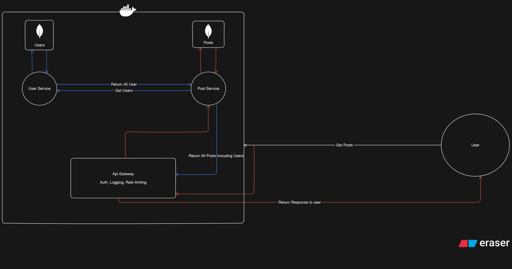

# 🛠️ Node.js Microservices Boilerplate with Docker Compose

A **production-ready** microservices template built with **Node.js**, **Express**, and **MongoDB**, following **clean architecture** principles.  
Designed for developers who want **scalable microservice-based architecture** with **API Gateway**, **Docker Compose**, and **service-to-service communication**.

---

## 📸 Project Architecture Overview

 <!-- Replace with your actual image path -->

---

## 📁 Folder Structure

### **User Service (`/user-service`)**
- `/src` – Main source directory  
  - `/api` – API routes and controllers for user operations  
  - `/jobs` – Scheduled jobs or background tasks related to users  
  - `/utils` – Utility/helper functions for user service  
  - `/validators` – Input validation logic for user requests  
  - `/services` – Business logic and database interaction for users  
- `package.json` – Dependencies and scripts for user service  

---

### **Posts Service (`/posts-service`)**
- `/src` – Main source directory  
  - `/api` – API routes and controllers for post operations  
  - `/jobs` – Scheduled jobs or background tasks related to posts  
  - `/utils` – Utility/helper functions for post service  
  - `/validators` – Input validation logic for post requests  
  - `/services` – Business logic and database interaction for posts  
- `package.json` – Dependencies and scripts for posts service  

---

### **API Gateway (`/api-gateway`)**
- `/src` – Main source directory for gateway logic  
  - `/api` – Routing for incoming requests to microservices  
  - `/middlewares` – Authentication, rate limiting, logging, and security middlewares  
  - `/utils` – Helper functions used across the gateway  
- `package.json` – Dependencies and scripts for API gateway  

---

### **Root Files**
- `docker-compose.yml` – Docker Compose configuration to orchestrate all services

---

## 🚀 Features

### 🧩 Microservices
- **User Service** – Handles user registration, login, and user-related data.
- **Post Service** – Manages posts, linking them to their authors.
- **API Gateway** – Single entry point for all requests.

### 🔐 API Gateway
- Authentication
- Rate Limiting
- Centralized Logging
- Routes requests to appropriate services

### 🔄 Service-to-Service Communication
- Internal API calls using **Docker networking** (secure, no public exposure)
- Example: Fetch a user’s posts directly from the **Post Service**
- Example: Fetch post author data from **User Service**

---

## 🗄️ Tech Stack
- **Node.js** + **Express**
- **MongoDB** (Mongoose ODM)
- **Docker** + **Docker Compose**
- **REST API** + **Internal API calls**
- **JWT Authentication**
- **Rate Limiting**
- **Service Layer Architecture**

---

## 📌 Why This Architecture?

1. **Scalability** – Each service is independent and can be deployed separately.
2. **Security** – API Gateway handles authentication and rate limiting.
3. **Flexibility** – Swap out or scale services without affecting others.
4. **Maintainability** – Clear folder structure and separation of concerns.

---

## 🧪 Available APIs

### **User Service**
- `POST /users/register` → Register new user
- `POST /users/login` → User login
- `GET /users/:id` → Get user by ID (with posts via internal call)
- `POST /users/usersByIds` → Get users by IDS

### **Post Service**
- `POST /posts` → Create new post
- `GET /posts/:id` → Get post by ID (with user data via internal call)
- `GET /posts` → Get all posts (pagination + search)
- `POST /posts/betByIds` → Get all posts by ids

---

## 🚀 Getting Started

### 1️⃣ Clone the repository
```bash
git clone https://github.com/yourusername/nodejs-microservices-boilerplate.git
cd nodejs-microservices-boilerplate
```

### 2️⃣ Start all services with Docker Compose
``` 
docker-compose up --build
```

## 📦 Docker Compose Highlights
- All services run on an isolated internal Docker network  
- **API Gateway** is the only service exposed to the outside world  
- Services communicate securely via **service name** using Docker DNS  

---

## 💡 Use Cases
- Learning microservices architecture  
- Building scalable backend systems  
- Practicing service-to-service API calls  
- Deploying secure APIs with Docker Compose  

---

## 🔎 Keywords
`nodejs-microservices` `docker-compose` `api-gateway` `nodejs-best-practices` `microservice-architecture` `secure-api` `mongodb-aggregation` `rest-api-template`

---

## 🙌 Contributing
Feel free to fork, improve, and contribute to this template.  
Pull requests are welcome!
